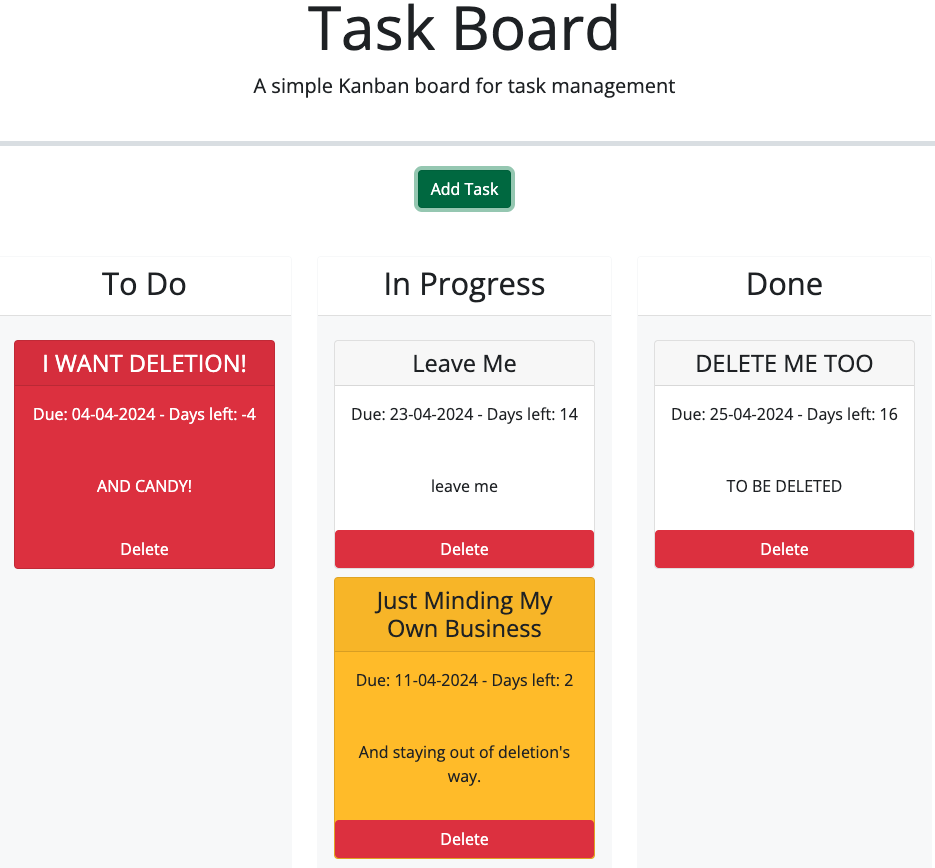

# 05 Third-Party APIs: Task Board

Bootcamp challenge to modify starting HTML, CSS and JavaScript code to make a simple Kanban task board functional.

## Your Task

Create a simple task board application that allows a team to manage project tasks in the browser with dynamically updated features using jQuery and the [Day.js](https://day.js.org/en/) API library.

[User Story](#user-story) and [Acceptance Criteria](#acceptance-criteria) are below.

## Screenshot


## Usage

The site is deployed to Github pages: [Github Pages URL](https://roughnut.github.io/kanban-task-board/ "link to deployed site")

## User Story

```md
AS A project team member with multiple tasks to organize
I WANT a task board 
SO THAT I can add individual project tasks, manage their state of progress and track overall project progress accordingly
```

## Acceptance Criteria

```md
GIVEN a task board to manage a project
WHEN I open the task board
THEN the list of project tasks is displayed in columns representing the task progress state (Not Yet Started, In Progress, Completed)
WHEN I view the task board for the project
THEN each task is color coded to indicate whether it is nearing the deadline (yellow) or is overdue (red)
WHEN I click on the button to define a new task
THEN I can enter the title, description and deadline date for the new task into a modal dialog
WHEN I click the save button for that task
THEN the properties for that task are saved in localStorage
WHEN I drag a task to a different progress column
THEN the task's progress state is updated accordingly and will stay in the new column after refreshing
WHEN I click the delete button for a task
THEN the task is removed from the task board and will not be added back after refreshing
WHEN I refresh the page
THEN the saved tasks persist
```
